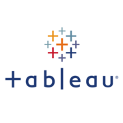
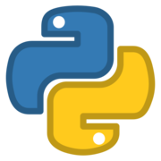
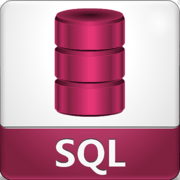

# <samp>Leandro Dionísio</samp>

My name is Leandro and I am here to learn programming languages.

Here are some information about me:

- 🔭 I’m currently working on the banking industry.
- 🌱 I’m currently learning Python, SQL and Tableau.
- 👯 I’m looking to collaborate on Python Projects.
- 🤔 I’m looking for help with learning more about programming languages. 
- 💬 Ask me about ...
- 📫 How to reach me: ...
- 😄 Pronouns: ...
- ⚡ Fun fact: ...

<h1 align="left">
 </h1>

<h1 align="left">
 </h1>
